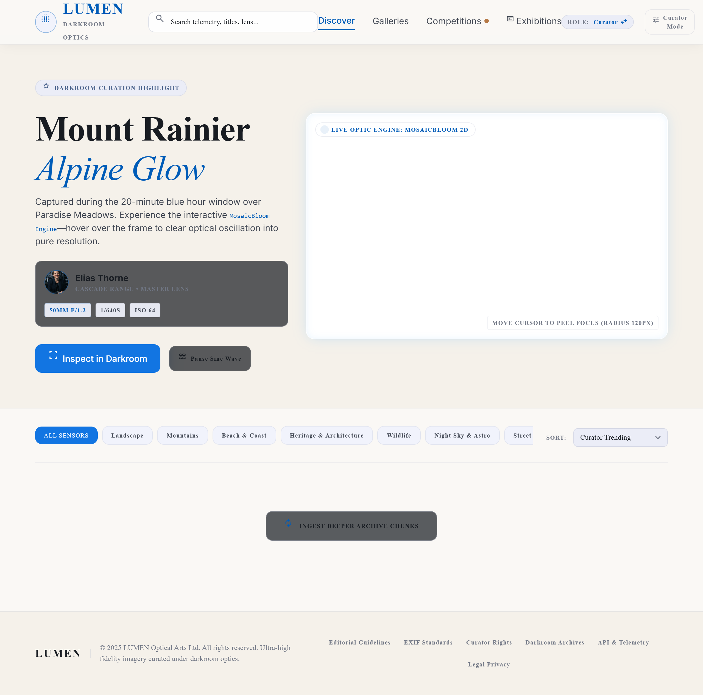

# LUMEN — Optical Arts & Cinematic Darkroom

> Ultra-high fidelity imagery curated under darkroom optics with an interactive 2D Canvas engine and server-backed curation terminal.



## Overview

LUMEN is a full-stack photography curation and darkroom telemetry platform. Built with a **Midnight & Champagne** aesthetic, it features:
- **MosaicBloom 2D Engine**: Procedural HTML5 Canvas hero with sine-wave particle oscillation and interactive focus-peeling on cursor hover.
- **Dynamic Photography Gallery**: Real high-resolution imagery categorized across Landscape, Mountains, Beach & Coast, Heritage & Architecture, Wildlife, Night Sky & Astro, Street & Culture, Food & Markets, and Others.
- **Darkroom Lightbox**: Fluid responsive HUD with camera, lens, shutter, aperture, and ISO telemetry, accompanied by a real-time critique logging system.
- **Weekly Grand Prix Leaderboard**: Dynamically calculated calendar week rankings with a live countdown timer until Sunday midnight UTC.
- **Dedicated Curator Terminal**: Server-side role-authenticated moderation suite (`/admin`) for telemetry metrics, daily ingestion cadence tracking, real-time approval pipelines, category taxonomy management, and operator access controls.
- **Calibrated Ingest Engine**: Photo upload modal with live mosaic-dissolve pixelation calibration effect.

---

## Tech Stack

- **Backend**: Node.js & Express RESTful API
- **Persistence**: Structured JSON database engine with automatic state persistence (`data/database.json`)
- **File Uploads**: `multer` file handling for local RAW/JPEG/PNG storage
- **Frontend**: Clean Vanilla CSS design system (Midnight & Champagne palette), zero external runtime script dependencies
- **Typography**: Google Fonts (*Inter*, *Playfair Display*, *JetBrains Mono*)

---

## Getting Started

### Prerequisites

- [Node.js](https://nodejs.org/) (v18+)
- `npm`

### Installation

1. Clone the repository:
   ```bash
   git clone https://github.com/rio4508/LUMEN.git
   cd LUMEN
   ```

2. Install dependencies:
   ```bash
   npm install
   ```

3. Start the application:
   ```bash
   npm start
   ```

4. Open your browser:
   - **Public Gallery**: [http://localhost:3000](http://localhost:3000)
   - **Curator Terminal**: [http://localhost:3000/admin](http://localhost:3000/admin)

---

## Demo Credentials

- **Curator Master**:
  - Email: `curator@lumen.lens`
  - Password: `curator123`
- **Photographer**:
  - Email: `kenji@lumen.lens`
  - Password: `photo123`

---

## License

MIT License © 2026 LUMEN Optical Arts Ltd.
